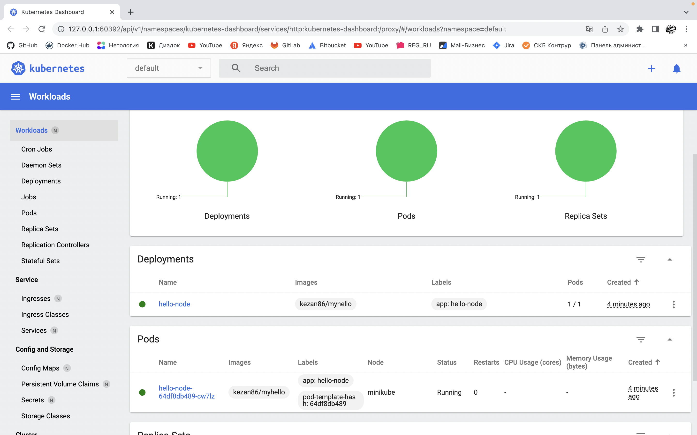
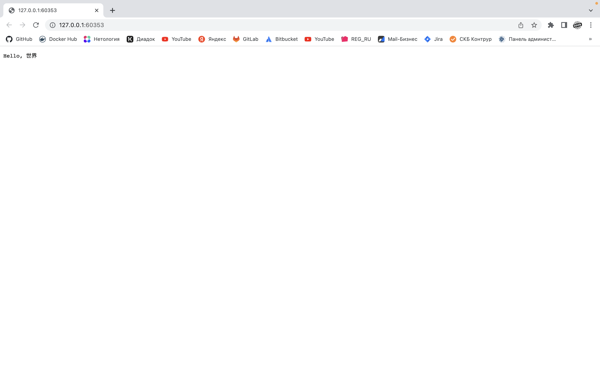

# Домашнее задание к занятию "12.1 Компоненты Kubernetes"

Вы DevOps инженер в крупной компании с большим парком сервисов. Ваша задача — разворачивать эти продукты в корпоративном кластере. 

## Задача 1: Установить Minikube

Для экспериментов и валидации ваших решений вам нужно подготовить тестовую среду для работы с Kubernetes. Оптимальное решение — развернуть на рабочей машине Minikube.

## Ответ:

Установлено: статус ниже

```
➜  ~ minikube status
minikube
type: Control Plane
host: Running
kubelet: Running
apiserver: Running
kubeconfig: Configured
```

```
➜  ~ kubectl get po -n kube-system
NAME                               READY   STATUS    RESTARTS      AGE
coredns-6d4b75cb6d-xskqs           1/1     Running   0             57s
etcd-minikube                      1/1     Running   0             67s
kube-apiserver-minikube            1/1     Running   0             68s
kube-controller-manager-minikube   1/1     Running   0             68s
kube-proxy-5tqtx                   1/1     Running   0             57s
kube-scheduler-minikube            1/1     Running   0             67s
storage-provisioner                1/1     Running   1 (57s ago)   66s
```

## Задача 2: Запуск Hello World
После установки Minikube требуется его проверить. Для этого подойдет стандартное приложение hello world. А для доступа к нему потребуется ingress.

- развернуть через Minikube тестовое приложение по [туториалу](https://kubernetes.io/ru/docs/tutorials/hello-minikube/#%D1%81%D0%BE%D0%B7%D0%B4%D0%B0%D0%BD%D0%B8%D0%B5-%D0%BA%D0%BB%D0%B0%D1%81%D1%82%D0%B5%D1%80%D0%B0-minikube)
- установить аддоны ingress и dashboard

## Ответ:

Установлено: статус ниже

```
➜  ~ minikube dashboard
🤔  Verifying dashboard health ...
🚀  Launching proxy ...
🤔  Verifying proxy health ...
🎉  Opening http://127.0.0.1:55773/api/v1/namespaces/kubernetes-dashboard/services/http:kubernetes-dashboard:/proxy/ in your default browser...
```

Аддоны установлены:

```
➜  ~ minikube addons list
|-----------------------------|----------|--------------|--------------------------------|
|         ADDON NAME          | PROFILE  |    STATUS    |           MAINTAINER           |
|-----------------------------|----------|--------------|--------------------------------|
| ambassador                  | minikube | disabled     | 3rd party (Ambassador)         |
| auto-pause                  | minikube | disabled     | Google                         |
| csi-hostpath-driver         | minikube | disabled     | Kubernetes                     |
| dashboard                   | minikube | enabled ✅   | Kubernetes                     |
| default-storageclass        | minikube | enabled ✅   | Kubernetes                     |
| efk                         | minikube | disabled     | 3rd party (Elastic)            |
| freshpod                    | minikube | disabled     | Google                         |
| gcp-auth                    | minikube | disabled     | Google                         |
| gvisor                      | minikube | disabled     | Google                         |
| headlamp                    | minikube | disabled     | kinvolk.io                     |
| helm-tiller                 | minikube | disabled     | 3rd party (Helm)               |
| inaccel                     | minikube | disabled     | InAccel <info@inaccel.com>     |
| ingress                     | minikube | enabled ✅   | 3rd party (unknown)            |
| ingress-dns                 | minikube | disabled     | Google                         |
| istio                       | minikube | disabled     | 3rd party (Istio)              |
| istio-provisioner           | minikube | disabled     | 3rd party (Istio)              |
| kong                        | minikube | disabled     | 3rd party (Kong HQ)            |
| kubevirt                    | minikube | disabled     | 3rd party (KubeVirt)           |
| logviewer                   | minikube | disabled     | 3rd party (unknown)            |
| metallb                     | minikube | disabled     | 3rd party (MetalLB)            |
| metrics-server              | minikube | disabled     | Kubernetes                     |
| nvidia-driver-installer     | minikube | disabled     | Google                         |
| nvidia-gpu-device-plugin    | minikube | disabled     | 3rd party (Nvidia)             |
| olm                         | minikube | disabled     | 3rd party (Operator Framework) |
| pod-security-policy         | minikube | disabled     | 3rd party (unknown)            |
| portainer                   | minikube | disabled     | Portainer.io                   |
| registry                    | minikube | disabled     | Google                         |
| registry-aliases            | minikube | disabled     | 3rd party (unknown)            |
| registry-creds              | minikube | disabled     | 3rd party (UPMC Enterprises)   |
| storage-provisioner         | minikube | enabled ✅   | Google                         |
| storage-provisioner-gluster | minikube | disabled     | 3rd party (unknown)            |
| volumesnapshots             | minikube | disabled     | Kubernetes                     |
|-----------------------------|----------|--------------|--------------------------------|
```

Образ представленный в туториале, не поддерживается на MacOS на M1, поэтому я взял свой образ с похожим смыслом `kezan86/myhello`

```
✗ kubectl create deployment hello-node --image=kezan86/myhello
deployment.apps/hello-node created
```

```
✗ kubectl get deployments
NAME         READY   UP-TO-DATE   AVAILABLE   AGE
hello-node   1/1     1            1           2m41s
```

```
✗ kubectl get pods
NAME                          READY   STATUS    RESTARTS   AGE
hello-node-64df8db489-24xbt   1/1     Running   0          2m59s
```

Мой образ работает на порту 8888
```
✗ kubectl expose deployment hello-node --type=LoadBalancer --port=8888
service/hello-node exposed
```

Сервис запущен:

```
➜  ~ minikube service hello-node
|-----------|------------|-------------|---------------------------|
| NAMESPACE |    NAME    | TARGET PORT |            URL            |
|-----------|------------|-------------|---------------------------|
| default   | hello-node |        8080 | http://192.168.49.2:30213 |
|-----------|------------|-------------|---------------------------|
🎉  Opening service default/hello-node in default browser...
```





## Задача 3: Установить kubectl

Подготовить рабочую машину для управления корпоративным кластером. Установить клиентское приложение kubectl.
- подключиться к minikube 
- проверить работу приложения из задания 2, запустив port-forward до кластера

## Ответ:

Установлено: статус сервиса ниже

```
➜  ~ kubectl get services
NAME         TYPE           CLUSTER-IP      EXTERNAL-IP   PORT(S)          AGE
hello-node   LoadBalancer   10.107.10.189   <pending>     8080:30213/TCP   9s
kubernetes   ClusterIP      10.96.0.1       <none>        443/TCP          11m
```
